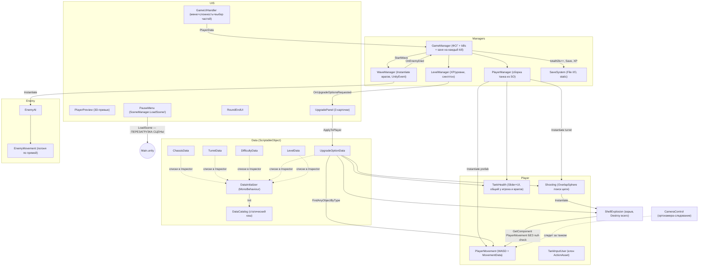
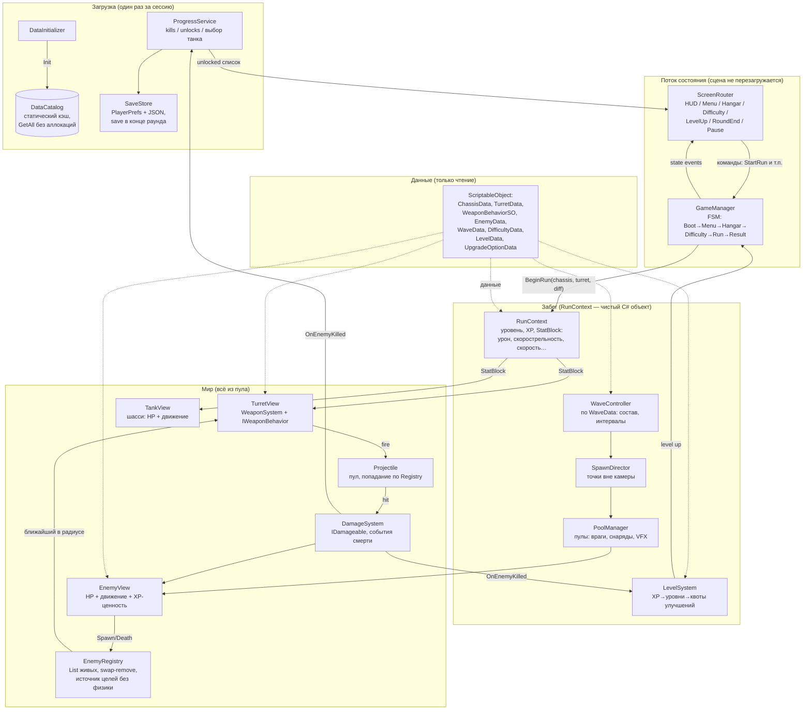

# Архитектурный аудит «Tank Survival»

**Создано:** 2026-09-22 · **Автор:** Cline (AI-агент Архитектор) · **Статус:** аудит завершён; реализация ведётся по `tasks.md`

**Стек:** Unity 6000.5.9f1 · URP 17.5.0 · Input System 1.20.0 · uGUI + TextMeshPro · Post Processing 3.5.4 · цель — WebGL

> **Режим работы (мультиагентный):** **Архитектор** (этот агент) анализирует, проектирует, ведёт этот документ и `tasks.md` — production-код не пишет. **Исполнитель** (отдельный ИИ-агент) реализует задачи из `tasks.md` по порядку и зависимостям. Этот файл — обоснование и техзадание для обеих сторон; если контекст потерян — читай этот файл и `tasks.md` вместо повторного исследования проекта.
>
> **Распределение правды:** целевая архитектура и обоснования — здесь; живой план работ, статусы и счётчик прогресса — **только в `tasks.md`** (раздел 8 этого файла — регламент передачи, дублировать чек-лист здесь запрещено).
>
> **Ключевые ограничения** (из `.clinerules`): производительность WebGL — главный приоритет (пулы, ноль аллокаций в кадре, статические батчи); сцена **никогда** не перезагружается между раундами; на экране **100–200+ врагов** и снаряды; в `Update/FixedUpdate` — никаких дорогих операций и аллокаций; каждое архитектурное решение — с Pros/Cons и влиянием на WebGL.
>
> **Суть геймдизайна** (актуальный `game_design.md`): модульный танк «Шасси + Турель»; турель автоматически атакует ближайшего врага; игрок управляет только перемещением и выбором улучшений; **до 5 типов врагов** (сейчас на диске 1), волны приходят **каждые n секунд с точек спавна**, состав/частота/количество зависят от сложности (3 сложности); враги **бьют при контакте**; при level-up выбор 1 из 3 улучшений; между забегами сохраняется только глобальный счётчик убийств (+ разблокировки); все числовые параметры — через ScriptableObject, новый контент — без изменения кода.

---

## 0. Контекст проекта

| Параметр | Значение |
|---|---|
| Unity | 6000.5.9f1 (Unity 6) |
| Рендер | URP 17.5, ортографическая камера, изометрия |
| Ввод | Input System 1.20 (`Input/TankControl.inputactions`) |
| UI | uGUI + TMP (UI Toolkit не используется) |
| Пакеты | Post Processing 3.5, AI Navigation (врагами не используется) |
| Происхождение кода | переработанный Unity Tanks! туториал |
| Контент на диске | 4 шасси, 4 турели, 1 тип врага (Simple Enemy), 3 сложности, 5 улучшений, LevelCurve |
| Сцена | `Scenes/Main.unity` — единственная, задумана как «вечная» (без перезагрузок) |

Структура сцены: `CameraRig` (CameraControl) · `LevelDesert` · `Spawn Point` · `model preview(d)` · `Managers` (GameManager, PlayerManager, WaveManager, LevelManager, DataInitializer) · `UI`.

Все скрипты лежат в `Assets/Tank Survival/Scripts/` — 27 файлов в папках Camera, Data, Enemy, Managers, Player, Shell, UI (полная карта с вердиктами — в разделе 5.1).

---

## 1. Что уже есть и как это связано (as-is)

**Поток данных как есть:** `GameUIHandler` → `GameManager.StartGameFromMenu(PlayerData)` → `PlayerManager.SpawnTank` (инстанцирует шасси и турель из SO) → `WaveManager.StartWave` → спавн врагов из `Update` → события смерти → `GameManager` (kills++, `SaveSystem.Save`, XP в `LevelManager`) → level-up → `UpgradePanel` → `UpgradeOptionData.ApplyToPlayer` (находит компоненты в сцене через `FindAnyObjectByType`).

Направление потока в целом верное (UI → менеджеры → события → UI), но внутренности многих звеньев не переживут высокую плотность объектов на WebGL.

## 2. Критические проблемы интеграции (фактические баги)

Проверено по коду и ассетам (префабы, гуиды скриптов). Это не вкусовщины — места, где игра не работает или сломается в WebGL:

1. **Турель не монтируется в раунде.**
   `PlayerManager.SpawnTank()` ищет ребёнка `"TurretPos"`, но во **всех** префабах шасси (`body_standart`, `body_fat`, `body_fancy`, `body_veteran`) точка называется `"TurretMount"`. `PlayerPreview` ищет `"TurretMount"` (и его warning-текст врёт, упоминая «TurretPos»). Итог: в превью башня есть, в игре — `LogError` и возврат без турели.
   *Исправление: точка монтажа должна жить в данных (`ChassisData` — поле/компонент MountPoint на префабе), а не в строковых константах двух разных классов.*

2. **Враг неиграбелен.**
   Префаб `Prefabs/Enemy/Simple Enemy.prefab` содержит только `Transform + MeshFilter + MeshRenderer + CapsuleCollider + Rigidbody` — **нет** `EnemyAI`, `EnemyMovement`, `TankHealth`. `WaveManager.SpawnEnemy` молча пропускает (`if (move)`, `if (health)`, `if (ai)`) → враги стоят на месте, турель не стреляет (`Shooting.FindNewTarget` отбрасывает цели без `TankHealth`), враги не умирают → **волна никогда не завершается**.
   Плюс `TankHealth.Awake` → `Instantiate(m_ExplosionPrefab)` и `SetHealthUI()` со `Slider` — на врагах NPE/исключения, если добавить компонент без UI-обвязки. Нужен отдельный `EnemyData` и отдельная HP-логика врага без UI.

3. **`PauseMenu` перезагружает сцену.**
   `SceneManager.LoadScene(GetActiveScene().buildIndex)` в кнопке «Select Tank». При этом `DataCatalog.s_Initialized` — статический флаг: после перезагрузки он уже `true`, а `DataInitializer.Awake` защищён от повторного Init → **после рестарта каталог пуст**, все `Get...()` вернут null. Синглтоны пересоздадутся, статика — нет. Прямое нарушение правила «сцена не перезагружается».
   *Исправление: убрать `LoadScene`; возврат в меню = сброс состояния через FSM.*

4. **Улучшения «Урон/Взрыв» не работают.**
   `UpgradeOptionData.ApplyToPlayer()` делает `FindAnyObjectByType<ShellExplosion>()` и меняет `m_MaxDamage/m_ExplosionRadius/m_ExplosionForce` на **случайном существующем инстансе снаряда**. Следующие снаряды инстанцируются из префаба с дефолтами — бонусы теряются. `damageBonus` из `ShootingData` вообще нигде не применяется к урону. Бонусы обязаны жить в источнике (`RunContext`/`StatBlock`), а не в одноразовом инстансе.

5. **`ShellExplosion.OnTriggerEnter` → NPE на врагах.**
   `targetRigidbody.GetComponent<PlayerMovement>().AddExplosionForce(...)` без null-проверки — у врагов `PlayerMovement` нет.

6. **Сохранение на каждое убийство.**
   `GameManager.OnEnemyDied` → `SaveSystem.Save` (синхронный `File.WriteAllText`) на каждый kill; там же на каждый kill: `DataCatalog.GetAllChassis()`/`GetAllTurrets()`, которые **создают и сортируют новые List'ы** (GC на каждое убийство), и LINQ `Any()` внутри `PlayerProgress`.

7. **UI-аллокации в горячем цикле.**
   `GameManager.Update()` → `UpdateUI()` каждый кадр: `$"Убийств: {...}"` + присвоение `TMP_Text.text` → перегенерация меша текста и аллокация строк **каждый кадр**. `GameUIHandler.Update()` трогает `CanvasScaler.matchWidthOrHeight` каждый кадр. `LevelManager.Update()` — `xpBarFill.fillAmount` каждый кадр.

8. **Жёсткий хардкод против ГД.**
   `TOTAL_WAVES = 3`, «+5 врагов за волну», «×0.2 HP / ×0.1 скорости за волну», радиус спавна 15, XP за убийство = 10, пауза между волнами 3 с (`Invoke`) — всё в коде. По ГД число волн и состав зависят от сложности; XP зависит от типа врага. Нужны `WaveData`/`EnemyData` (их нет).

9. **Поражение недостижимо: у врагов нет контактного урона (ГД-разрыв).**
   В коде нет механизма урона игроку при касании — а ГД требует «идти к игроку, бить при контакте». `TankHealth.TakeDamage` игрока вызывается только из `ShellExplosion` (свои же взрывы). Событие смерти игрока никем не отслеживается: `GameManager.EndRound` срабатывает только после всех волн → условие «забег завершается немедленно, если игрок уничтожен» не реализовано.
   *Исправление (Фаза 0): минимальный компонент контактного урона на враге + сигнал смерти игрока в GameManager → EndRound.*

10. **Префабы не укомплектованы: компоненты и ссылки создаются рантаймом.**
    Проверено по гуидам: на 4 префабах шасси нет `PlayerMovement`/`TankHealth`/`TankInputUser` (добавляются `AddComponent` в `PlayerManager` при спавне), на 4 префабах турелей нет `Shooting` → после спавна `m_Shell`, `m_FireTransform`, `enemyMask` не назначены (выстрел невозможен), `TankInputUser` без `TankControl.inputactions` не подключает ввод (движение не работает). Аудио-поля `PlayerMovement` тоже пусты.
    *Исправление (Фаза 0): докомплектовать префабы сериализованными компонентами и ссылками; SO — только для числовых статов.*

**Мелкие, но реальные:**
- `DifficultyData.isUnlocked` дублирует флаги `PlayerProgress` — два источника правды;
- `WaveManager.StartWave` мутирует поля инстансов (`move.m_Speed *= ...`, `health.m_StartingHealth *= ...`) — работает, потому что инстансы свежие, но при пуле это станет багом (мутация возвращённых в пул объектов);
- `EnemyDeathListener` (`AddComponent` на каждый спавн + `UnityEvent` + подписка) — аллокации и хрупкость через `OnDestroy`;
- `Shooting.AutoAiming()` объявлен, но не вызывается; кэширование `Rigidbody` цели есть, но в цикле поиска — `GetComponent<Rigidbody>` + `GetComponent<TankHealth>` на каждый коллайдер;
- `GameManager` использует `Invoke(nameof(StartNextWave), 3f)` — магическая пауза, хрупко.

## 3. Отсутствующие модули (критичны для старта)

| Модуль | Статус | Почему критичен |
|---|---|---|
| Пул объектов | ❌ отсутствует | `Instantiate/Destroy` врагов, снарядов, частиц, карточек UI → GC-шторм на WebGL при сотнях объектов |
| Менеджер волн под ГД | ⚠️ заглушка | Нет `WaveData` (состав, соотношение типов, частота), нет данных о 5 типах врагов (по актуальному ГД) |
| Система «шасси+турель» | ⚠️ сломана | Монтаж по строковому имени, нет единой точки сборки, нет конвенции монтажа в данных |
| Реестр врагов (spatial) | ❌ | Поиск цели через `Physics.OverlapSphere`; нужен дешёвый источник «кто жив» без физики |
| Система урона (`IDamageable`) | ❌ | Один `TankHealth` с UI-слайдером тащит и игрока, и врагов — источник NPE |
| Прогрессия забега | ⚠️ | Бонусы применяются к компонентам напрямую, теряются при ре-спавне, нет единого хранилища статов |
| Ангар как экран | ❌ | Есть dropdown'ы в главном меню; по ГД нужен отдельный экран АНГАР с сохранением выбора |
| Событийная шина | ⚠️ | `UnityEvent` создаются/подписываются на каждый спавн — аллокации |
| Сохранение под WebGL | ⚠️ | `File.*` работает через IDBFS, но правильнее `PlayerPrefs` + сохранение в конце раунда |
| Комплектация префабов (ввод/оружие/HP) | ❌ | Компоненты и ссылки создаются рантаймом (`AddComponent`); снаряд, точка выстрела, маски и ввод не назначены — турель и движение игрока не работают (§2.10) |
| Контактный урон врагов | ❌ | ГД: «бить при контакте» — в коде отсутствует; поражение игрока недостижимо (§2.9) |
| `EnemyData` / `WaveData` | ❌ | Без них требование ГД «новые враги/волны без изменения кода» невыполнимо |

## 4. Целевая архитектура (to-be)

**Принцип:** данные (SO) читаются один раз при создании объекта; всё, что живёт дольше кадра (списки, буферы, пулы) — переиспользуется; UI обновляется **событиями**, а не из `Update`.

### 4.1 Классы и зоны ответственности

**Core**

| Класс | Ответственность |
|---|---|
| `GameManager` | FSM состояний, оркестрация: BeginRun → волны → Result. Без UI-кода и подсчётов |
| `RunContext` | Чистый объект забега: уровень, XP, `StatBlock`, выбранные id. Создаётся/сбрасывается, не статик |
| `StatBlock` | Аккумулятор модификаторов (урон, fireRate, скорость, HP…) — сюда применяются апгрейды; компоненты читают отсюда |
| `ScreenRouter` | Показ/скрытие экранов по состоянию FSM; замена россыпи `SetActive` в текущем `GameManager` |

**Data (SO)**

| Класс | Ответственность |
|---|---|
| `ChassisData` | Префаб, статы, **ссылка/конвенция точки монтажа турели**, стоимость открытия |
| `TurretData` | Префаб, статы, `WeaponBehaviorSO` (тип атаки + параметры), снаряд, дальность |
| `WeaponBehaviorSO` | Данные поведения оружия (single / chain lightning / AoE) — новые турели без кода |
| `EnemyData` | **НОВОЕ**: HP, скорость, XP-ценность, вес в составе волны, префаб |
| `WaveData` | **НОВОЕ**: длительность/состав/интервалы волны — числа «+5», «×0.2» уходят сюда |
| `DifficultyData` | Число волн, множители, набор WaveData (убрать `isUnlocked` — дублирует Progress) |
| `DataCatalog` | Оставить; `GetAll*()` → кэшированные `IReadOnlyList` (без сортировки на каждый вызов) |

**Combat**

| Класс | Ответственность |
|---|---|
| `EnemyRegistry` | Статический `List<EnemyView>` живых врагов; swap-remove; источники целей для всех турелей/AoE без `OverlapSphere` |
| `WeaponSystem` (на турели) | Кулдаун, выбор цели из Registry, вызов `IWeaponBehavior` |
| `IWeaponBehavior` + `SingleShotBehavior` / `ChainLightningBehavior` / `AoEBlastBehavior` | Поведение атаки; параметры из `WeaponBehaviorSO` |
| `Projectile` | Пул; движение по прямой, попадание по Registry (дистанция), урон в `IDamageable` |
| `DamageSystem` | Единая точка урона и смертей; событие `OnEnemyKilled(EnemyView)` |
| `IDamageable` | Интерфейс вместо `GetComponent<TankHealth>` |

**Units**

| Класс | Ответственность |
|---|---|
| `TankView` | Шасси: HP, движение (Input), кэш Rigidbody, UI-слайдер внутрь не тащит |
| `TurretView` | Турель: точка монтажа передаётся **полем**, а не `Find("строка")` |
| `EnemyView` | HP + движение к игроку + XP-ценность; возврат в пул вместо Destroy |
| `EnemyHealth` (враги; у игрока `TankHealth` остаётся до миграции после Ф2) | HP-состояние без UI; полоски — отдельные `HealthBar`, слушают события |

**Spawning / Waves**

| Класс | Ответственность |
|---|---|
| `PoolManager` | Пулы на `UnityEngine.Pool.ObjectPool` с prewarm; возврат вместо Destroy |
| `WaveController` | Тайминг по `WaveData`, состав волны (веса `EnemyData`), сигналы начала/конца |
| `SpawnDirector` | Точки спавна за пределами обзора, без аллокаций Vector3 в кадре |

**Progress / Save**

| Класс | Ответственность |
|---|---|
| `ProgressService` | Общий счётчик убийств, разблокировки, выбранные шасси/турель (для Ангара) |
| `SaveStore` | `PlayerPrefs` + JSON; сохранение в конце раунда и при выходе в меню |
| `LevelSystem` | XP→уровни по `LevelData`; генерация 3 вариантов в буфер без LINQ |
| `UpgradeApplier` | Применение улучшения к `RunContext.StatBlock` (никаких `FindAnyObjectByType`) |

**UI**

| Класс | Ответственность |
|---|---|
| `HudController` | Обновление по событиям; **кэш последнего значения** — TMP пишем только при изменении |
| `MainMenuScreen` / `HangarScreen` / `DifficultyScreen` / `LevelUpScreen` / `RoundEndScreen` / `PauseScreen` | Один экран — один класс; кнопки → команды в GameManager |
| `HangarTankPreview` | Текущий `PlayerPreview`, но турель монтируется по данным, а не по имени |

**Прочее**

| Класс | Ответственность |
|---|---|
| `CameraControl` | Оставить как есть (орто-следование) |
| `TankInputUser` | Оставить; клонирование ассета — раз за жизнь объекта |

## 5. Что оставить / доработать / переписать

| Вердикт | Файлы | Комментарий |
|---|---|---|
| ✅ Оставить почти как есть | `CameraControl`, `TankInputUser`, `DataCatalog`, `DataInitializer`, `LevelData` | Работают, малый долг |
| ✅ Оставить, расширив | `ChassisData`, `TurretData`, `DifficultyData`, `UpgradeOptionData`, `PlayerMovement` | В SO добавить `EnemyData`/`WaveData`; из `PlayerMovement` убрать UI-шум |
| 🔧 Доработать | `WaveManager` → (`WaveController`+`PoolManager`), `LevelManager` → `LevelSystem`, `UpgradePanel`, `RoundEndUI`, `PlayerPreview`, `PlayerManager` | Каркас правильный, менять механику внутренностей |
| ❌ Переписать | `Shooting`, `ShellExplosion`, `TankHealth`, `GameManager`, `SaveSystem` → `SaveStore`, `PauseMenu`, `EnemyAI`/`EnemyMovement` → `EnemyView` | Унаследованы от туториала «2 танка на арену», не под 200+ врагов |
| 🗑 Удалить | `EnemyDeathListener`, `MovementData`/`ShootingData` | Заменяются событиями пула и `StatBlock` |

### 5.1 Полная карта скриптов (27 файлов)

| Файл | Вердикт | Заметка |
|---|---|---|
| `Camera/CameraControl.cs` | ✅ | Орто-следование; оставить |
| `Data/ChassisData.cs` | ✅ расширить | + точка монтажа, + сохранение выбора |
| `Data/TurretData.cs` | ✅ расширить | + `WeaponBehaviorSO` |
| `Data/DataCatalog.cs` | 🔧 | Убрать аллокации `GetAll*` (кэшированные списки) |
| `Data/DataInitializer.cs` | ✅ | + поддержка явного ре-Init (сброс `s_Initialized`) |
| `Data/DifficultyData.cs` | 🔧 | Убрать `isUnlocked`; добавить число волн и ссылку на WaveData |
| `Data/LevelData.cs` | ✅ | Оставить кривую XP |
| `Data/PlayerProgress.cs` | 🔧 | Перейти в `ProgressService`; убрать LINQ `Any` |
| `Data/TurretData.cs` (поле снаряда) | ✅ | Снаряд → пул |
| `Data/UpgradeOptionData.cs` | ❌ переписать | `ApplyToPlayer` через `FindAnyObjectByType` не работает (§2.4) |
| `Enemy/EnemyAI.cs` | 🗑 | Влить в `EnemyView` |
| `Enemy/EnemyMovement.cs` | 🔧→❌ | Переписать под кинематику + Registry |
| `Managers/GameManager.cs` | ❌ | FSM; без `UpdateUI` в Update, без save-на-kill |
| `Managers/LevelManager.cs` | 🔧 | → `LevelSystem`, UI по событиям |
| `Managers/PlayerManager.cs` | 🔧 | Монтаж по ссылке; сборка танка |
| `Managers/SaveSystem.cs` | ❌ | → `SaveStore` на PlayerPrefs |
| `Managers/WaveManager.cs` | ❌ | → `WaveController` + пул + `WaveData` |
| `Player/PlayerMovement.cs` | ✅ | Оставить физику движения |
| `Player/Shooting.cs` | ❌ | → `WeaponSystem` + Registry |
| `Player/TankHealth.cs` | ❌ | → `Health` + отдельный UI |
| `Player/TankInputUser.cs` | ✅ | Оставить |
| `Shell/ShellExplosion.cs` | ❌ | → `Projectile` + пул + `IDamageable` |
| `UI/GameUIHandler.cs` | 🔧 | Разбить на экраны; убрать Update |
| `UI/PauseMenu.cs` | 🔧 | Убрать `LoadScene` |
| `UI/PlayerPreview.cs` | 🔧 | Монтаж по данным |
| `UI/RoundEndUI.cs` | 🔧 | События |
| `UI/UpgradePanel.cs` | 🔧 | Пул карточек, события |

## 6. Ключевые решения: Pros/Cons и влияние на WebGL

**1. Пул: `UnityEngine.Pool.ObjectPool` vs кастомный.**
Рекомендация — `ObjectPool<T>` для компонентов (`EnemyView`, `Projectile`) + тонкий враппер с prewarm.
Pros: проверенный API, `CollectionCheck`, `actionOnGet/Release`, ноль кода владения. Cons: чуть больше абстракции. Кастомный пул даёт полный контроль, но это лишний код для соло-разработчика. Выигрыш на WebGL одинаков — главное убрать `Instantiate/Destroy` из цикла.

**2. Поиск цели: физика vs Registry.**
`OverlapSphere` на каждое оружие при сотнях врагов — аллокации + тяжёлый вызов физики. `EnemyRegistry` (обычный `List` + swap-remove) — перебор по обычной арифметике: на порядок дешевле физического запроса и без GC.
Cons: надо аккуратно поддерживать список при смерти/деспавне (решает `DamageSystem`).

**3. Сохранение: `File` vs `PlayerPrefs`.**
`PlayerPrefs` на WebGL — нативный и надёжный путь; JSON-строка внутри — тот же формат данных. Сохранение — только в конце раунда. Pros: без IDBFS-особенностей, меньше кода. Cons: лимит объёма — несущественно для нашего прогресса.

**4. События: `UnityEvent` на инстанс vs C#-event.**
`UnityEvent`, создаваемые/подписываемые на каждый спавн (текущий `EnemyDeathListener`) — аллокации на каждого врага. C#-события на `DamageSystem` — ноль аллокаций при постоянных подписчиках. Cons: нет Inspector-отображения — для симуляции не нужно.

**5. Физика врагов: Rigidbody vs кинематика.**
Сейчас каждый враг — `Rigidbody` c `Continuous` collision detection: при 200+ телах это убийство физического шага в WebGL. Предложение: кинематический `Rigidbody` (`MovePosition`) или вовсе без физики — движение трансформом + мягкое разведение через grid.
Pros: главный выигрыш по CPU. Cons: теряем физические «пробки» — заменяем намеренным сепарейшеном.

**Дополнительные WebGL-заметки:**
- статические батчи для `LevelDesert`, GPU instancing для одинаковых врагов;
- один общий SFX-пул с лимитом голосов вместо `AudioSource` на каждом снаряде;
- `sqrMagnitude` вместо `magnitude` в горячих путях;
- TMP: менять `text` только при изменении значения;
- IL2CPP без JIT: избегать boxing и LINQ в кадре.

---

## 7. Порядок работ (этапы)

1. **Фаза 0 — починка интеграций (быстрые победы):** монтажная точка турели по ссылке; префаб врага с логикой; убрать `LoadScene` из паузы; NPE в `ShellExplosion`.
2. **Фаза 1 — ядро выживания:** `RunContext` + `StatBlock`; `DamageSystem`/`IDamageable`; `EnemyRegistry`; пул врагов и снарядов; `EnemyData`.
3. **Фаза 2 — волны и ГД:** `WaveData`/`WaveController`/`SpawnDirector`; XP из `EnemyData`; level-up/апгрейды через `StatBlock`.
4. **Фаза 3 — прогресс и UI:** `ProgressService` + `SaveStore` (PlayerPrefs); Ангар как экран; разбивка UI на экраны; HUD по событиям.
5. **Фаза 4 — WebGL-оптимизация:** кинематические враги; статические батчи уровня; instancing; лимит SFX-голосов; профилирование.

> **Детальная разбивка всех фаз на атомарные задачи** (T001…, зависимости, ограничения, статусы, счётчик прогресса) — в **`tasks.md`**. Этот файл задачи не дублирует.

---

## 8. Передача в реализацию (регламент)

- **Живой план работ:** `tasks.md` — атомарные задачи T001…T051, сгруппированные по фазам §7, с приоритетами, зависимостями (`→`), ограничениями, сложностью и статусом `Готово: [ ]`. Счётчик прогресса ведётся в шапке `tasks.md` и является единственным источником правды по прогрессу.
- **Исполнитель** берёт задачи строго по порядку приоритета, учитывая зависимости: задача не может быть закрыта при незакрытых зависимостях. Ограничения задачи обязательны; общие правила WebGL (без аллокаций в кадре, без `Find*`/LINQ/строк в `Update`, сцена не перезагружается) действуют всегда.
- **Отступления от архитектуры** (другое имя класса, иной способ интеграции, изменение порядка) запрещены: задача возвращается Архитектору с комментарием для пересогласования, после чего Архитектор обновляет этот документ и/или `tasks.md`.
- **Завершение фазы:** последняя задача каждой фазы — смоук-тест; его результат фиксируется Исполнителем в `tasks.md`. Только после смоук-теста фазы разрешено начинать следующую.
- Права на редактирование: `tasks.md` — статусы/счётчик/заметки правит Исполнитель; структуру и постановку задач меняет только Архитектор. Этот документ правит только Архитектор.

---

*Конец документа. При изменении архитектуры обновляйте этот файл, чтобы он оставался актуальным снимком проекта.*

